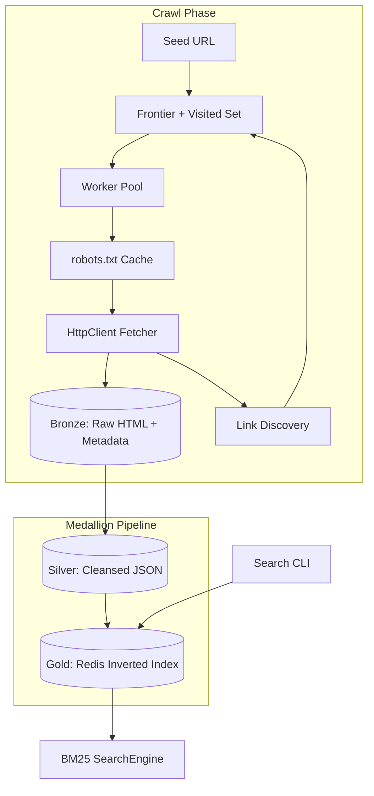

# Concurrent Web Crawler with Reverse Indexing

A multi-threaded web crawler and BM25 search engine built in Java. It uses a **Medallion Architecture** for data ingestion, **Redis** for the serving layer, and a **robots.txt** parser for polite crawling.

## Architecture



## Key Features

### 1. BM25 Ranking (Lucene-style)

Search uses Okapi BM25 instead of raw term frequency:

```
score = Σ IDF(qi) × (tf × (k1 + 1)) / (tf + k1 × (1 - b + b × |D| / avgdl))
IDF  = log(1 + (N - df + 0.5) / (df + 0.5))
```

Redis stores the metadata BM25 requires:

| Key | Purpose |
|-----|---------|
| `idx:term:{word}` | url → term frequency |
| `idx:df:{word}` | document frequency |
| `idx:meta:doclen` | url → document length |
| `idx:meta:total_doclen` | sum of all document lengths |
| `idx:meta:docs` | all indexed URLs |
| `idx:meta:terms` | all indexed terms |

### 2. Medallion Data Pipeline

| Layer | Storage | Contents |
|-------|---------|----------|
| **Bronze** | `data/bronze/` | Raw HTML + HTTP metadata JSON |
| **Silver** | `data/silver/` | Cleansed structured JSON (links, terms, title) |
| **Gold** | Redis | Inverted index for fast search |

The crawler writes Bronze only. Silver and Gold are separate, rerunnable jobs — so you can re-parse or re-index without recrawling.

### 3. robots.txt Compliance

Before every fetch, workers consult a per-domain `RobotsCache` that:

1. Fetches `https://{domain}/robots.txt` once
2. Parses `User-agent`, `Allow`, and `Disallow` rules (including `*` and `$` wildcards)
3. Applies longest-match semantics before allowing a URL

## Prerequisites

- Java 17+
- Docker (for Redis)

## Quick Start

**1. Start Redis**
```bash
docker compose up -d
```

**2. Build**
```bash
mvnw.cmd clean package
```

**3. Crawl (Bronze → Silver → Gold automatically)**
```bash
java -jar target/concurrent-web-crawler-1.0.0.jar crawl https://example.com --max-pages 20
```

**4. Or run pipeline stages manually**
```bash
# Bronze only during crawl
java -jar target/concurrent-web-crawler-1.0.0.jar crawl https://example.com --bronze-only

# Promote Bronze → Silver
java -jar target/concurrent-web-crawler-1.0.0.jar pipeline silver

# Promote Silver → Gold (Redis)
java -jar target/concurrent-web-crawler-1.0.0.jar pipeline gold
```

**5. Search with BM25**
```bash
java -jar target/concurrent-web-crawler-1.0.0.jar search "example domain"
```

## Reproducible Demo

The checked-in Silver corpus avoids network-dependent demo results:

```bash
docker compose up -d redis
java -jar target/concurrent-web-crawler-1.0.0.jar pipeline gold --data-dir sample-data
java -jar target/concurrent-web-crawler-1.0.0.jar search "distributed crawler"
java -jar target/concurrent-web-crawler-1.0.0.jar serve
```

Public API endpoints:

| Endpoint | Purpose |
|----------|---------|
| `GET /search?q=distributed&limit=10` | BM25 search |
| `GET /stats` | Index document/term counts |
| `GET /health` | Redis-backed readiness check |
| `GET /metrics` | Prometheus metrics |

## Reliability and Distributed Crawling

HTTP requests retry `429` and `5xx` responses up to three attempts with bounded exponential backoff. Client errors fail fast. A JVM shutdown hook interrupts workers, closes resources, and returns leased Redis work immediately.

Use a persistent Redis frontier when multiple crawler nodes should share one crawl job:

```bash
# Run this command on two or more nodes with the same namespace.
java -jar target/concurrent-web-crawler-1.0.0.jar crawl https://example.com \
    --distributed --frontier-namespace example-crawl --lease-seconds 30 \
    --redis-host redis.example.internal --max-pages 1000
```

Redis atomically deduplicates discovered URLs. Polled work receives a lease; expired leases are returned to the queue after node failure. Different crawl jobs must use different namespaces.

## Benchmarks

Crawl summaries report elapsed time, pages/second, Redis index bytes, and JVM heap usage. Search benchmarks include warmup, throughput, and latency percentiles:

```bash
java -jar target/concurrent-web-crawler-1.0.0.jar benchmark \
    "distributed crawler" "java concurrency" --warmup 50 --iterations 1000
```

Benchmark results are machine and corpus specific; record the CPU, memory, JVM, Redis topology, corpus size, and command when publishing numbers.

## Monitoring

```bash
docker compose --profile monitoring up -d --build
```

- Search API: `http://localhost:7000`
- Prometheus: `http://localhost:9090`
- Grafana: `http://localhost:3000` (`admin` / `admin`, local demo only)

Prometheus captures request count/latency plus index document, term, and byte gauges. Logs are structured JSON through Logback.

## Testing

```bash
# Unit, concurrency, and failure-injection tests
mvnw.cmd test

# Redis/Testcontainers integration tests
mvnw.cmd -Pintegration-tests verify

# API load test (requires k6 and a running server)
k6 run load-tests/search.js
```

The load test enforces less than 1% request failures and p95 latency below 250 ms. CI runs unit tests, Redis integration tests, a Docker build, and publishes main-branch images to GHCR.

## Cloud Deployment

Replace `OWNER` and the image tag in `deploy/kubernetes.yml`, then apply it to any Kubernetes service (EKS, GKE, or AKS):

```bash
kubectl apply -f deploy/kubernetes.yml
```

The manifest includes two API replicas, resource requests/limits, health probes, graceful termination, and Redis service discovery. For production, replace the included single Redis deployment with a managed Redis service and persistent backups.

## Project Layout

```
src/main/java/com/crawler/
├── Main.java
├── CrawlerEngine.java
├── config/
├── frontier/
├── worker/              # Bronze writer + robots check
├── fetch/               # HttpClient + JSoup
├── index/               # Redis inverted index + BM25 metadata
├── search/              # Bm25Scorer + SearchEngine
├── rate/                # Per-domain delay
├── robots/              # robots.txt parser + cache
└── pipeline/            # BronzeStore, SilverProcessor, GoldIndexer
```

## Design Notes

- Link discovery still happens during crawl (required for BFS), but **indexing is decoupled** through Silver/Gold.
- Re-indexing a URL replaces its old postings and adjusts document frequency counts.
- Detailed decisions, failure semantics, and scaling limits are in `docs/architecture.md`.
